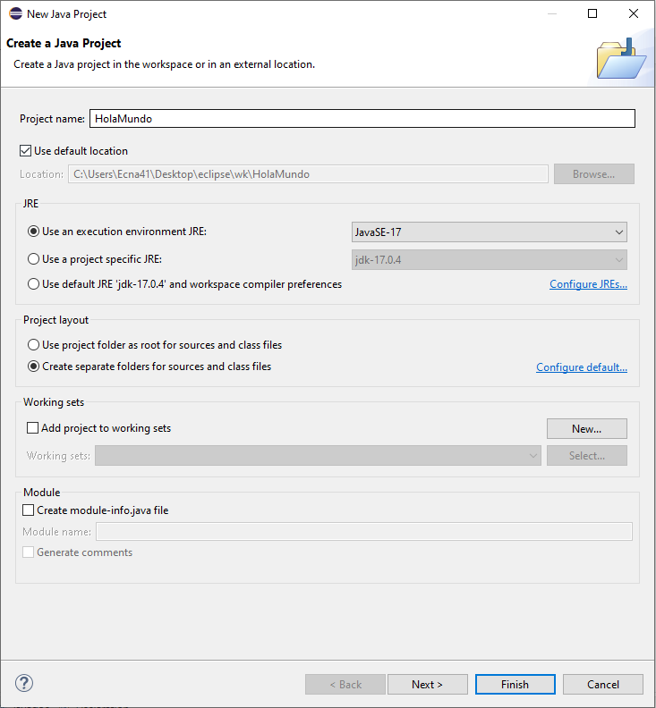
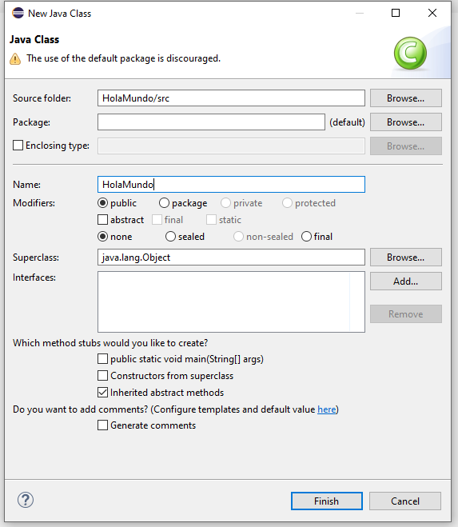

- [Ménu](../README.md)

# Hola Mundo

## Opciones al crear nuestro proyecto Java



- Proyect name: "HolaMundo" sera el nombre de nuestro proyecto
- JRE: sera la versión que utilizaremos. En este caso utilizaremos la 17
- Module: desmarcarmos esta opción. Esto hara que no nos genere un module-info para nuestro proyecto.

## Estructura del proyecto

- HolaMundo
  - JRE System Library
  - src

JRE son las apis basicas de java, y src es el directorio donde crearemos nuestro clases java.

## Crearemos nuestra primera clase

File -> new -> Class



Por ahora solo le daremos nombre a nuestra clase y la crearemos con las opciones por defecto.

```java
    public class HolaMundo {

    }
````
<details><summary>Nomenclatura</summary>


Los nombre de las clases, variables y metodos siguen ciertas reglas que debemos tener en cuenta a la hora de definir.

1- El nombre debe comenzar por una letra, guión bajo (_) o un simbolo de divisa ($, €, ¥...).

2- Los nombres pueden incluir números, pero nunca comenzar con ellos.

3- El caracter uncio _ como nombre no esta permitido (A partir de Java 9 en adelante)

4 -No se puede utilizar ninguna de las palabras reservadas de java como nombre de una variable.

| || ||
| --- | --- | --- | --- |
| abstract | assert | boolean | break |
| byte | case | catch | char |
| class | const | continue | default |
| do | double | else | enum |
| extens | final | finally | float |
| for | goto | if | implements |
| import | instaceof | int | interface |
| long | native | new | packagae |
| private | protected | public | return |
| short | static | strictfp | super |
| switch | synchronized | this | throw |
| throws | transient | try | void |
| volatile | while || |

- De esta forma podemos tener normbre validos como:
    -HolaMundo
    -MyClase
    -myclase2
    -$estoTambienVale

- Pero no podriamos tener nombres como:
    -Hola Mundo
    -2holaMundo

No es obligatorio y pero por consenso se utiliza la notación CamelCase. Y en el caso de las clases siempre se suele comenzar por mayuscula y en metodos y variables por minuscula.

</details>

Por defecto, las aplicaciones java tiene una función inicial (main) que es punto de inicio de la aplicación. La syntaxis de la función siempre es la misma ->

```java
    public static void main (String[] args) {

    }
````
y se lo añadiremos a nuestra clase junto con un mensaje para decir "Hola Mundo"

```java
    public class HolaMundo {
        public static void main (String[] args) {
    	        System.out.print("Hola Mundo");
            }
    }
````

## Ejecutar el programa

Originalmente habria que compilar la clase y luego ejecutarla con los comandos javac y java. Pero el ide nos ayuda a desarrollar y se encarga por nostros.
Flecha verde.

## Bonus

Si queremos ejecutar nuestra Hola Mundo de una forma más grafica.

```java
import javax.swing.JOptionPane;

public class HolaMundo {
    public static void main (String[] args) {
    	JOptionPane.showMessageDialog(null, "Hola Mundo");
    }
}
````

El import trae a nuestra clase el codigo necesario para poder ejecutar la función que queremos
