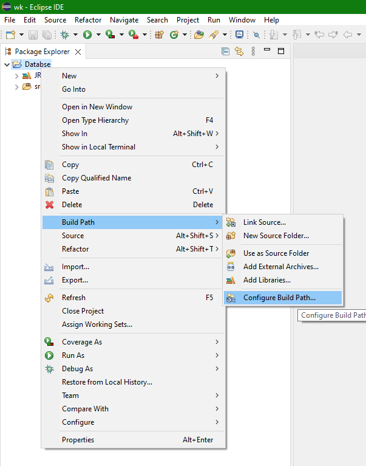
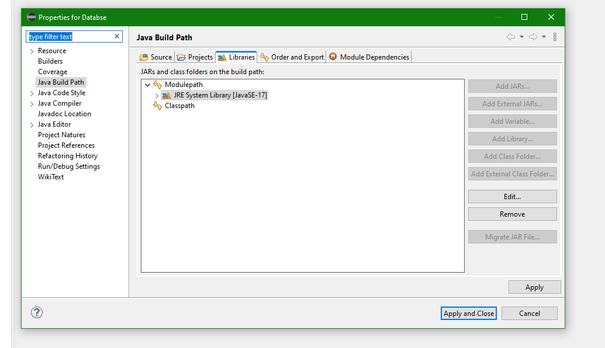
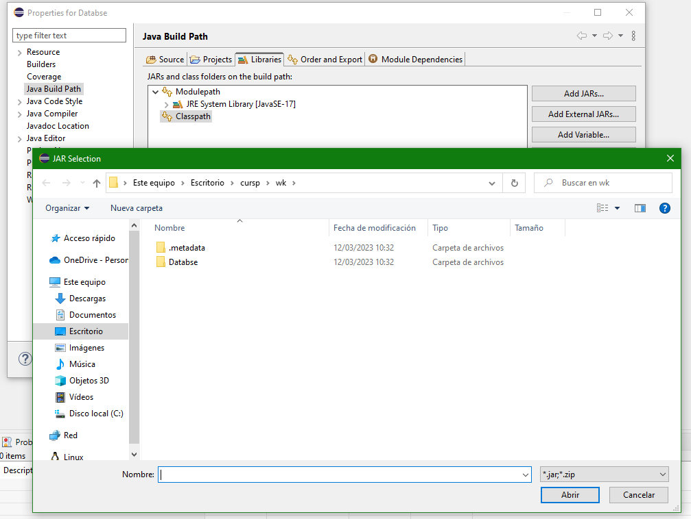
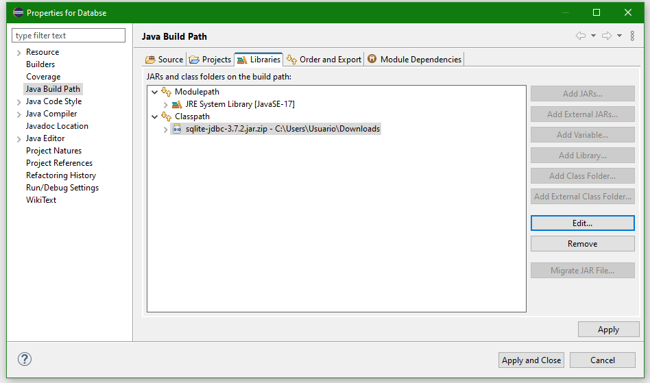

- [Menú](../README.md)

# Conexión BBDD

Para conectarnos con una base de datos, necesitamos las clases proporcionadas por el porveedor de la bbdd;







## Código

### JDBC 3.0 vs 4.0 Drivers

Si tenemos una librería inferior a la versión 4.0, necesitamos registrar la clase.
En caso contrario podemos utilizar sin registrar la clase.


### JDBC URL

Ejemplo ->
jdbc:postgres://localhost:5432/zoo

- jdbc es el protocolo
- postgres es el proveedor de la bbdd
- localhost la url donde esta alojada la bbdd
- 5432 el puerto que utiliza para conectarse
- zoo el nombre de la bbdd que se va a conectar

### Objetos necesarios

Connection -> conexión con base de datos
PrepraredStatement -> objeto que realizara la petición a bbdd
ResultSet -> respuesta en caso de hacer una sentencia "Select"

¿Como obtener la conexión?

````java
Connection con = DriverManager.getConnection(url)
````

¿Como ejecutar una sentencia?

````java
con.prepareStatement("Select * from Persons");
````

Si es una sentencia "Select"

````java
pt.executeQuery();
````

Devuelve un objeto result set 

````java
	var resultSet = pt.executeQuery();
			while(resultSet.next()) {
				System.out.println(resultSet.getInt(1));
				System.out.println(resultSet.getString(2));
				System.out.println(resultSet.getString(3));
				
			}
````

En caso de ser otra sentencia devuelve un int con el número de filas afectadas y se utiliza executeUpdate

````java
int resultSet = pt.executeUpdate();
````

#### Todo junto

````java
package database;

import java.sql.Connection;
import java.sql.DriverManager;
import java.sql.SQLException;

public class Database {

	public static void main(String[] args) throws SQLException, ClassNotFoundException {
		
		// Registramos la clase  si el dirver es inferior a la versión 4.0
        Class.forName("org.sqlite.JDBC");
        
        // URL
		String url = "jdbc:sqlite:C:\\Users\\Usuario\\Desktop\\pro\\lite.txt";
		// con
		try(Connection con = DriverManager.getConnection(url)){
			var pt = con.prepareStatement("Select * from Persons");
			var resultSet = pt.executeQuery();
			while(resultSet.next()) {
				System.out.println(resultSet.getInt(1));
				System.out.println(resultSet.getString(2));
				System.out.println(resultSet.getString(3));
				
			}
		}
	}

}
````

#### Pasar parametros

Para evitar problemas de ejecutar sentencias no deseadas introducidas por los usuarios, tenemos una manera de pasar parámetros a las sentencias SQL

````java
			var pt = con.prepareStatement("Select * from Persons where PersonID = ?");
			pt.setString(1,"Mi parametro");f
````
